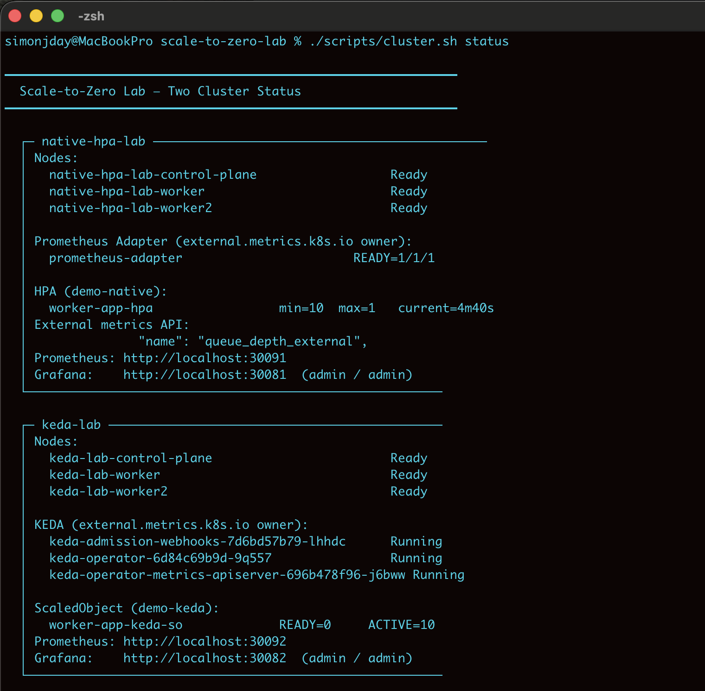

# Scale-to-Zero Lab: Native HPA vs KEDA



Two fully independent kind clusters for an honest side-by-side comparison.

## Why Two Clusters?

Both Prometheus Adapter and KEDA register as the `v1beta1.external.metrics.k8s.io` APIService backend. Kubernetes enforces single ownership — they cannot coexist. Any single-cluster comparison is testing "HPA consuming KEDA metrics", not native HPA.

```
kind-native-hpa-lab              kind-keda-lab
Prometheus + Grafana             Prometheus + Grafana
Prometheus Adapter               KEDA 2.16
  owns external.metrics API        owns external.metrics API
autoscaling/v2 HPA               keda.sh/v1alpha1 ScaledObject
minReplicas: 0                   minReplicaCount: 0
NO KEDA                          NO Prometheus Adapter
```

## Quick Start

```bash
# Prerequisites: Docker Desktop (>=6GB RAM), kind, kubectl, helm
brew install kind kubectl helm

chmod +x scripts/*.sh
./scripts/cluster.sh up          # creates both clusters (~10 min)
./scripts/demo-native-hpa.sh     # native HPA walkthrough
./scripts/demo-keda.sh           # KEDA walkthrough
./scripts/benchmark.sh 3 50      # timed comparison
```

## Access Points

| | native-hpa-lab | keda-lab |
|---|---|---|
| Prometheus | http://localhost:30091 | http://localhost:30092 |
| Grafana | http://localhost:30081 | http://localhost:30082 |
| Login | admin / admin | admin / admin |
| Dashboard | Scale-to-Zero Lab | Scale-to-Zero Lab |

## Cluster Management

```bash
./scripts/cluster.sh up [native|keda|both]    # create or restart
./scripts/cluster.sh down [native|keda|both]  # safe stop, state preserved
./scripts/cluster.sh nuke [native|keda|both]  # delete
./scripts/cluster.sh status                   # health check both clusters
./scripts/cluster.sh pf [native|keda|both]    # port-forward Grafana (if NodePort not mapped)
./scripts/cluster.sh logs native adapter      # Prometheus Adapter logs
./scripts/cluster.sh logs keda                # KEDA operator logs
```

## Grafana Dashboards

Both clusters have identical Scale-to-Zero Lab dashboards provisioned automatically — no import needed.

| | native-hpa-lab | keda-lab |
|---|---|---|
| URL | http://localhost:30081 | http://localhost:30082 |
| Login | admin / admin | admin / admin |
| Dashboard | Dashboards → Scale-to-Zero Lab | Dashboards → Scale-to-Zero Lab |

**Key panels:**

- **Queue Depth** — the metric both autoscalers respond to. Watch this drop first when demos drain the queue.
- **Worker Replicas** — ready pods. Lags behind queue depth by the autoscaler decision time (~15–30s) plus pod startup (~10–15s).
- **Queue Depth vs Replicas (dual-axis)** — the most useful panel. Both signals overlaid on one chart. The gap between queue dropping and replicas following is the observable latency.
- **HPA Current vs Desired** — internal HPA state. On native-hpa-lab, watch for the stepped 10→5→0 descent during scale-down. On keda-lab, watch for the 0→1→5 two-phase jump during wake-up.

**Health check before demos:** if Queue Depth shows `No data` or HPA shows `<unknown>/20`, see Known Issues below.

---

## Running the Benchmark

```bash
# 1. Reset queues to baseline (demos leave them at 0)
kubectl --context kind-native-hpa-lab exec -n demo-native deploy/fake-metrics -- \
  wget -qO- "http://127.0.0.1:8080/set?queue_depth=10"
kubectl --context kind-keda-lab exec -n demo-keda deploy/fake-metrics -- \
  wget -qO- "http://127.0.0.1:8080/set?queue_depth=10"

# 2. Wait ~60s then confirm both workloads are back at 1 replica
kubectl --context kind-native-hpa-lab get deployment worker-app -n demo-native
kubectl --context kind-keda-lab get deployment worker-app-keda -n demo-keda
# Both should show 1/1 READY before continuing

# 3. Optional: warm the image cache on first run after cluster creation (discard result)
./scripts/benchmark.sh 1 50

# 4. Run the actual benchmark
./scripts/benchmark.sh 3 50
```

**Expected results** (images cached, `pollingInterval=15s`, `stabilizationWindowSeconds=30s`):

```
┌─────────────────────┬────────────┬────────────┬─────────────┐
│ Approach            │ Avg (ms)   │ Min (ms)   │ Max (ms)    │
├─────────────────────┼────────────┼────────────┼─────────────┤
│ Native HPA          │ 25237      │ 24235      │ 27220       │
│ KEDA                │ 27327      │ 24261      │ 30425       │
└─────────────────────┴────────────┴────────────┴─────────────┘
```
*Actual results from lab run on M3 MacBook, K8s 1.36.1, KEDA 2.16,
`pollingInterval=15s`, `stabilizationWindowSeconds=30s`, images cached.*

Observed latency was comparable: ~25s avg for native HPA, ~27s avg for KEDA. Both are bounded by the 15s polling/HPA loop cadence plus pod startup. Variance of ±5s between runs reflects where in the 15s cycle the metric injection lands. Total runtime: ~15–20 minutes for 3 runs.

Results are saved to `benchmark-results-<timestamp>.json`.

---

## Known Issues and Fixes

### HPA shows `<unknown>/20`
Prometheus Adapter is not serving external metrics. Reinstall with correct values:

```bash
cat > /tmp/adapter-values.yaml << 'EOF'
prometheus:
  url: http://prometheus-kube-prometheus-prometheus.monitoring.svc
  port: 9090
rules:
  default: false
  external:
    - seriesQuery: 'queue_depth_total{namespace!="",pod!=""}'
      resources:
        overrides:
          namespace:
            resource: namespace
      name:
        as: queue_depth_external
      metricsQuery: 'sum(<<.Series>>{<<.LabelMatchers>>}) by (namespace)'
EOF

kubectl --context kind-native-hpa-lab delete configmap prometheus-adapter -n monitoring
helm upgrade --install prometheus-adapter \
  prometheus-community/prometheus-adapter \
  --kube-context kind-native-hpa-lab --namespace monitoring \
  --values /tmp/adapter-values.yaml --wait --timeout 3m
```

### ScaledObject CRD not found
CRD propagation lag after KEDA Helm install:
```bash
helm upgrade --install keda kedacore/keda \
  --kube-context kind-keda-lab --namespace keda \
  --version 2.16.0 --set watchNamespace="" --wait --timeout 5m
kubectl --context kind-keda-lab apply -f manifests/keda/00-keda-stack.yaml
```

### Grafana 404
Cluster created before Grafana NodePort mapping was added:
```bash
./scripts/cluster.sh pf    # port-forward both Grafana instances
```

## File Structure

```
scale-to-zero-lab/
├── scripts/
│   ├── cluster.sh              # Two-cluster lifecycle manager
│   ├── demo-native-hpa.sh      # Native HPA guided demo
│   ├── demo-keda.sh            # KEDA guided demo
│   └── benchmark.sh            # Timed latency comparison
├── manifests/
│   ├── native-hpa/
│   │   ├── 00-native-stack.yaml           # NS, fake-metrics, HPA
│   │   ├── 01-prometheus-adapter-config.yaml
│   │   └── 02-worker-realistic.yaml       # SIGTERM-aware worker
│   ├── keda/
│   │   └── 00-keda-stack.yaml             # NS, fake-metrics, worker, ScaledObject
│   └── grafana/
│       └── dashboard-configmap.yaml       # Scale-to-Zero Lab dashboard
└── docs/
    └── technical-deep-dive.md  # Full reference with real observed data
```

## Resource Requirements

| Cluster | RAM | Installed |
|---|---|---|
| native-hpa-lab | ~2.5GB | Prometheus, Grafana, Prometheus Adapter |
| keda-lab | ~2.5GB | Prometheus, Grafana, KEDA |
| Both | ~5GB | Set Docker Desktop memory to ≥6GB |

